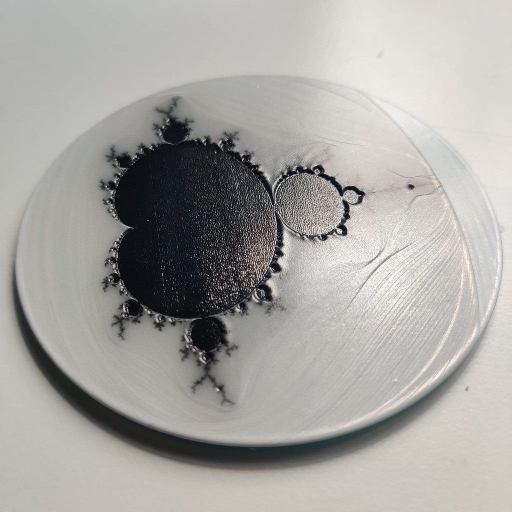

# eufyMake printer at DoES Liverpool

Simple notes for **anyone visiting [DoES Liverpool](https://doesliverpool.com/)** who wants to use the **[eufyMake](https://www.eufymake.com/) E1** — a desktop **UV inkjet** printer that can build **raised, full‑colour “3D texture”** on flat objects (and more with add‑ons you may not have on site).

You do **not** need a technical background. When something below says “software” or “file”, think “the **desktop app** on the **DoES laptop** (or your own computer)” and “the project you save before printing”.

## Introduction sessions

**eufyMake** have **lent** this printer to **[DoES Liverpool](https://doesliverpool.com/) makerspace** for **one year**. DoES are **organising introduction and induction events** for people who want to try the printer or learn the basics — many sessions are **bookable on Eventbrite**. Example: **[Introduction to the eufyMake E1 UV texture printer](https://www.eventbrite.co.uk/e/introduction-to-the-eufymake-e1-uv-texture-printer-tickets-1988761821143)** *(search Eventbrite or ask DoES for other dates if that listing has passed).*

You can also check **[doesliverpool.com](https://doesliverpool.com/)** events and ask when you visit the space.

## Time, money, and materials

The **introduction events are free** to book. Using the printer **afterwards is not free**: DoES ask people to **pay for usage** so **ink and other running costs** are covered. The **anticipated** charge is on the order of **about £1 per millilitre of ink** used — check with DoES for the **exact** rule when you visit, because pricing may be refined over time. In practice that **goes a long way**: **simple flat prints** (mostly a thin layer of ink) are usually **cheap**, while **textured / “3D texture” prints** cost **more** because the machine builds height with **many layers** of ink.

## What is already set up at DoES

These details are for **after you have been inducted** — see the **Introduction sessions** section above.

- **Laptop:** There is a **laptop in the makerspace connected to this printer** that you can **use for jobs at DoES**. You do **not** have to bring your own computer unless you prefer your own files or setup (see **What to bring**).
- **Network:** The printer is on the **DoES network**; the setup laptop is intended to **talk to the printer over that network** as part of the normal workflow (sending jobs, monitoring status — follow what you are shown on the day).
- **Software:** eufyMake supplies **desktop** software (commonly called **eufyMake Studio**) and a **phone app**. The **desktop application is more fully featured**; the **phone app** is useful for quick tasks but is **not a full substitute** for desktop if you want every option (especially **textured / multi‑layer** work). **Prefer the desktop app on the DoES laptop** unless a facilitator suggests otherwise.
- **Power and self-maintenance:** The printer runs **regular automatic maintenance** (cleaning / keep‑alive routines) so the **print heads** stay in good condition and are **less likely to block**. It should **remain connected to mains power** and sit in its **low‑power idle** state when nobody is printing — **do not** turn it off at the wall, unplug it, or strip its power **to save mains** unless a **DoES facilitator** tells you to (for example service or moving the machine). **Disrupting** those cycles can **clog** the heads and cause long downtime or cost for everyone.

## Access: using the printer after induction

**Right now**, once you are inducted, time on the eufyMake printer is **first come, first served** during your visit — **check with others** in the workshop so you are not jumping ahead of someone already set up.

If the printer becomes **heavily used** (“subscribed” / always in demand), DoES may **put a booking system in place**, **similar in spirit to the laser cutters** ([laser cutting at DoES](https://doesliverpool.com/laser-cutting/) — paid slots and inductions today). **Watch the [wiki](https://github.com/DoESLiverpool/somebody-should/wiki)**, **ask in the space**, or **post to the [DoES mailing list](mailto:does-liverpool@googlegroups.com)** for the latest rule so you don’t rely on an out‑of‑date note.

## Learning together — please share what you find

The eufyMake kit is **very new** in the makerspace, and **everyone at DoES is still figuring out** the best ways to use the hardware and software fairly and well. **You are part of that.**

**DoES asks people who try the printer** — after inductions, experiments, or paid jobs — to **write up what they learned** for the **community wiki** ([DoES Liverpool documentation on GitHub](https://github.com/DoESLiverpool/somebody-should/wiki)): what worked, what didn’t, materials, settings, gotchas, and photos if you can. That **helps the next visitor** and saves repeating the same mistakes. If you are **not sure where to add** your note, **ask someone at DoES** or look for an existing **eufyMake / UV printer** page to extend.

## Questions?

If something is **unclear** or you are **stuck** outside a staffed session, you can ask on the **DoES community mailing list**: **[does-liverpool@googlegroups.com](mailto:does-liverpool@googlegroups.com)** (hosted on Google Groups — join the list to post). **Tip:** say what you **already tried**, what **equipment** you are using, and attach a **photo** of the job or error if it helps; answers come from **members and volunteers**, not a help desk.

---

## What this machine is (in plain language)

- **It is not a normal paper printer.** It jets **UV‑cured ink** onto things like plastic, wood, metal, ceramic, acrylic, and many other surfaces (always check the manufacturer’s guidance for your exact item).
- **It can print tall enough layers that you can feel the design** — embossing, brush‑stroke effects, textures. Marketing often calls this **“3D‑texture UV printing”**; the ink hardens under UV light.
- **Typical workflow:** prepare a design in **eufyMake’s desktop software** (or a lighter workflow on the **phone app**), place your object on the bed, let the printer measure height where needed, then send the job from the app — **at DoES, usually from the laptop on the DoES network**.

Official overview and specs: [eufyMake E1 product page](https://www.eufymake.com/products/eufymake-e1).

---

## Example from DoES: Mandelbrot on a coaster

**Jackie Pease** ran this job on the DoES **eufyMake** printer: a **Mandelbrot set** (a famous mathematical fractal) on a **round coaster-sized disc**. The print shows **crisp edges** and **fine branching detail** around the black shape, on a **light grey** base — a good real-world sign that the machine can hold **high‑contrast artwork** and **intricate lines**.

*Photo: successful test print by Jackie Pease.  
If you want to try something similar, the repo includes an optional script (`scripts/generate_mandelbrot_heightmap.py`) that can produce a **greyscale height map** for texture-style workflows — most people will prepare art directly in **eufyMake Studio** instead.*

---

## Before you touch the printer

1. **Talk to someone at DoES first**  
   Makerspace tools are usually **induction-led**. Don’t assume you can walk up and use the machine alone. **Book an introduction** where offered — DoES often list these on **[Eventbrite](https://www.eventbrite.co.uk/)** (e.g. [this eufyMake E1 intro session](https://www.eventbrite.co.uk/e/introduction-to-the-eufymake-e1-uv-texture-printer-tickets-1988761821143)); new listings may appear for later dates. Otherwise ask at a **maker evening / workshop** or during your visit **where the printer and laptop live, whether they’re in use, and what the local rules are** (access — currently **first come, first served** after induction, unless a **booking** system is announced — plus network use, materials, cleanup). **After induction**, expect to use the **DoES laptop and desktop app** for full‑featured printing unless you are told differently.

2. **UV light and your eyes (and other people in the space)**  
   This type of printer uses **ultraviolet (UV) light** to cure the ink. **UV can harm eyesight** (and skin) if the machine is used wrongly or without understanding how it is meant to be operated. **Do not skip induction**: you need to know **safe working practice** — when lids or shields must stay closed, where it is safe to stand, and what to do if something looks odd — so you protect **yourself** and **others** using the workshop. If you are **at all unsure**, **stop** and ask someone at DoES **before** continuing.

3. **Read the manufacturer’s safety notes on UV ink**  
   Ink and cleaning supplies need **sensible handling** (skin/eye contact, ventilation, storage). Start here:  
   [All About eufyMake UV Ink](https://www.eufymake.com/blogs/news/all-about-eufymake-uv-ink).

4. **Plan what you are printing on**  
   **Not every object is suitable** (size, shape, surface, how it sits on the bed). If you are unsure, ask at DoES *before* you commit time to a design.

---

## What to bring (or have ready)

- **An idea** — logo, photo, graphic, or something from eufyMake’s “Make It Real” style tools (see links below).
- **Your own laptop (optional)** — a **laptop at DoES is already set up with the printer on the DoES network**; bring yours only if you prefer your own files, accounts, or software, and **check with DoES** whether that is appropriate for your session (Wi‑Fi, drivers, and accounts vary).
- **The object you want to print on** — **clean**, **dry**, and **allowed under local and manufacturer guidance**.
- **Patience the first time** — first prints often teach you about bed alignment, height measurement, and ink use.

---

## Simple path from “idea” to “printed object”

These are **high‑level** steps; the on‑screen software changes over time, so treat the **official app and guides** as the source of truth.

| Step | You… |
|------|------|
| 1 | **Use the desktop software** (**eufyMake Studio** — from [eufymake.com](https://www.eufymake.com/) under **Software / Support**). **At DoES:** open it on the **makerspace laptop** that is **paired with the printer on the DoES network** (you are **not** required to install anything on your own PC for a typical visit). **At home beforehand:** you *can* install the same desktop app to prepare files. **Phone app:** optional; **less capable** than desktop — fine for small tasks, **not** the full workflow for textured prints. |
| 2 | **Create or import** your design. Many people start from a photo or artwork; the tools can help with **layers / texture height** and colour. |
| 3 | **Choose material / preset** that matches what you are printing on (or follow DoES’s local profile if one exists). |
| 4 | On the printer: **place the object** carefully, **clear the area** of loose items, and follow the **on‑printer / app prompts** (height scan, positioning, etc.). |
| 5 | **Print**, stay nearby especially for the **first layers**, and note any **cleanup** steps (waste, wipes, lids — follow local and manufacturer instructions). |
| 6 | **Ask for help** if the job looks wrong (smearing, wrong height, head strikes). Stopping early is cheaper than damaging the head. |

Intro‑level context from the manufacturer:  
[UV printing beginner’s guide (buying / concepts)](https://www.eufymake.com/blogs/buying-guides/how-to-choose-a-uv-printer).

---

## Software and learning resources (official)

| What | Link |
|------|------|
| Main site (product, software downloads, support) | [eufymake.com](https://www.eufymake.com/) |
| Mobile vs desktop | **Desktop** (**eufyMake Studio**) is **more fully featured**; **phone app** is optional and **lighter**. **At DoES**, use the **desktop app on the provided laptop** (printer on **DoES network**) for normal sessions. |
| Web “Make It Real” creative area (as linked from product pages) | [makeitreal-beta.eufymake.com](https://makeitreal-beta.eufymake.com/) |
| Blog / tutorials | [eufyMake blogs](https://www.eufymake.com/blogs/news) |
| Community (social) | [eufyMake Facebook group](https://www.facebook.com/groups/eufymakeuvprintere1) (linked from manufacturer site) |
| DoES community (questions) | Mailing list: **[does-liverpool@googlegroups.com](mailto:does-liverpool@googlegroups.com)** — good for **Liverpool makerspace** questions about access, the wiki, or the printer at DoES |
| Manufacturer support email (from their FAQ) | `support@eufymake.com` |

If a link changes, start from **eufymake.com** and use their **Support** / **Software** menus.

---

## When something goes wrong

- **Pause or stop** if you hear odd noises, see the head drag, or smell anything unusual — then **get someone at DoES**.
- **If you see unexpected UV exposure**, an **open light path** when it should be shielded, or **anyone** might look into a **bright UV source** — **stop the job immediately**, ensure people move to a safe position, and **get help**. **Eye safety** is not something to troubleshoot alone.
- **Don’t open consumables** you don’t need, and **don’t guess** on cleaning fluids — wrong chemistry can wreck the machine.
- **Don’t cut mains power** or hard‑switch the printer off to “reset” a problem **without** talking to someone at DoES first — you can interrupt **scheduled head maintenance** and make **blockages** more likely.
- For **warranty / hardware faults**, you’ll need **whoever owns the machine** to contact **eufyMake support**; visitors usually can’t do that on someone else’s behalf.

---

## About this Git repository

This repo is mainly **documentation** for DoES visitors. It also contains an **optional technical extra**: a small Python script that generates a **greyscale height map** (for experiments where brightness is treated as height in other tools). Most people using the E1 will **never** need it; it’s kept for members who like that workflow.

- **Visitor guide:** this `README` (you’re reading it).
- **Optional script:** `scripts/generate_mandelbrot_heightmap.py` — see comments at the top of that file. Dependencies: `requirements.txt`.

Upstream Git remote (if you contribute changes): `git@github.com:DynamicDevices/does-eufy-printer.git`

**Licensing:** This repo is **dual-licensed**. **Code** (`scripts/`, `requirements.txt`) is under the **[MIT License](LICENSE-MIT)**. **Documentation and images** (e.g. this README, `assets/`) are under **[CC BY 4.0](LICENSE-CC-BY-4.0.txt)** — share and adapt if you give appropriate credit (see `LICENSE` for the split, and credit Jackie Pease for the sample photo as noted above).

---

*DoES organisers: if you have a **fixed location**, **laptop login / account policy**, **Wi‑Fi details** for bring‑your‑own‑device, **booking link**, or **local induction doc**, add them under **Before you touch the printer** or **What is already set up at DoES** so visitors have one clear place for Liverpool‑specific rules.*
